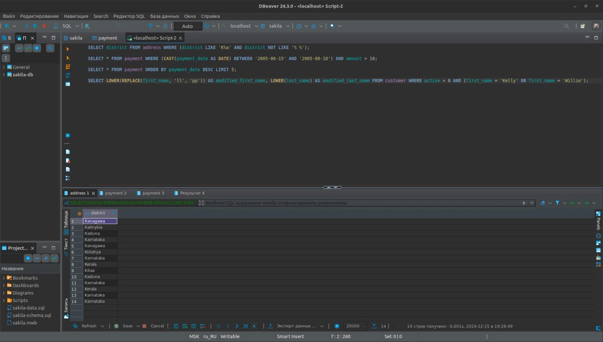
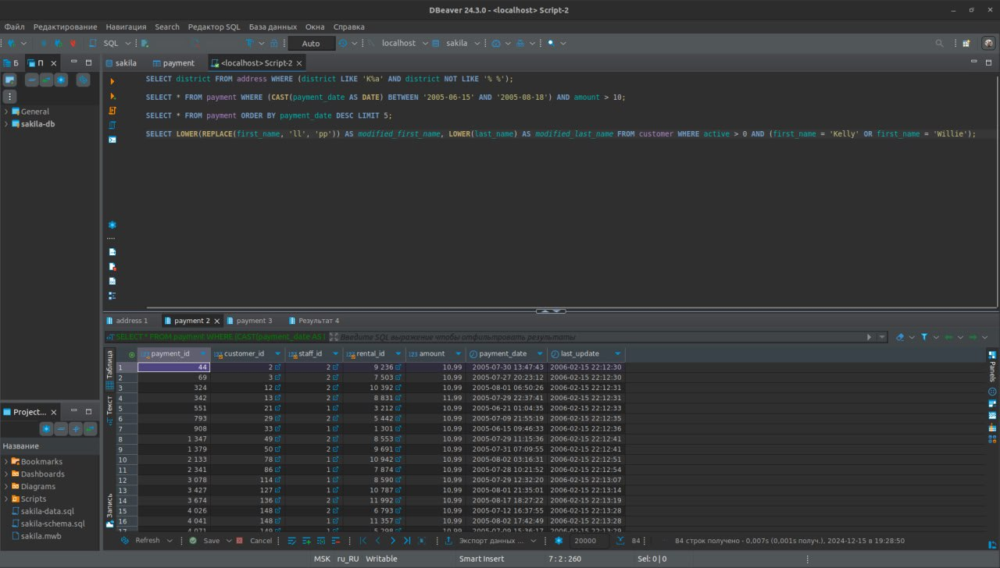
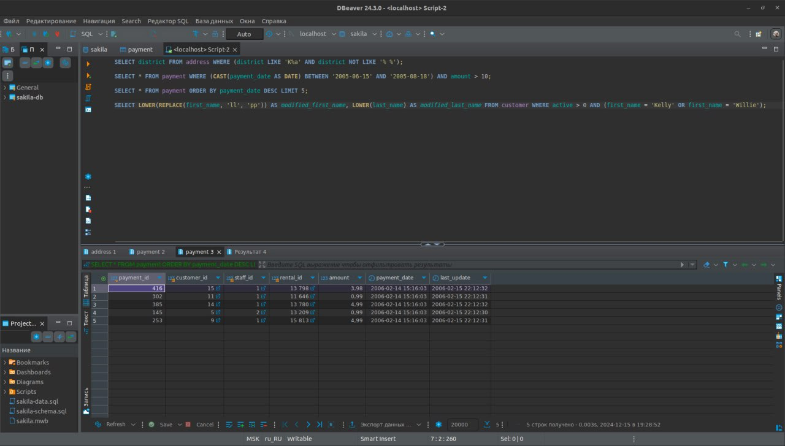
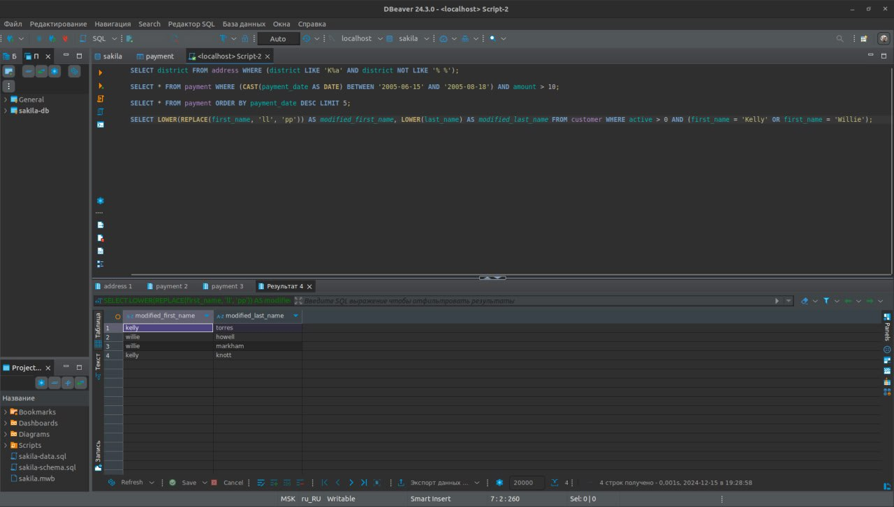

# Домашнее задание к занятию «SQL. Часть 1» Kolb Dmitry 

### Задание 1

Получите уникальные названия районов из таблицы с адресами, которые начинаются на “K” и заканчиваются на “a” и не содержат пробелов.

**Решение**
```
SELECT district FROM address WHERE (district LIKE 'K%a' AND district NOT LIKE '% %');
```



### Задание 2
Получите из таблицы платежей за прокат фильмов информацию по платежам, которые выполнялись в промежуток с 15 июня 2005 года по 18 июня 2005 года **включительно** и стоимость которых превышает 10.00.

**Решение**
```
SELECT * FROM payment WHERE (CAST(payment_date AS DATE) BETWEEN '2005-06-15' AND '2005-08-18') AND amount > 10;
```


### Задание 3

Получите последние пять аренд фильмов.

**Решение**
```
SELECT * FROM payment ORDER BY payment_date DESC LIMIT 5;
```


### Задание 4

Одним запросом получите активных покупателей, имена которых Kelly или Willie. 

Сформируйте вывод в результат таким образом:
- все буквы в фамилии и имени из верхнего регистра переведите в нижний регистр,
- замените буквы 'll' в именах на 'pp'.

**Решение**
```
SELECT LOWER(REPLACE(first_name, 'll', 'pp')) AS modified_first_name, LOWER(last_name) AS modified_last_name FROM customer WHERE active > 0 AND (first_name = 'Kelly' OR first_name = 'Willie');
```



## Дополнительные задания (со звёздочкой*)
Эти задания дополнительные, то есть не обязательные к выполнению, и никак не повлияют на получение вами зачёта по этому домашнему заданию. Вы можете их выполнить, если хотите глубже шире разобраться в материале.

### Задание 5*

Выведите Email каждого покупателя, разделив значение Email на две отдельных колонки: в первой колонке должно быть значение, указанное до @, во второй — значение, указанное после @.

### Задание 6*

Доработайте запрос из предыдущего задания, скорректируйте значения в новых колонках: первая буква должна быть заглавной, остальные — строчными.


